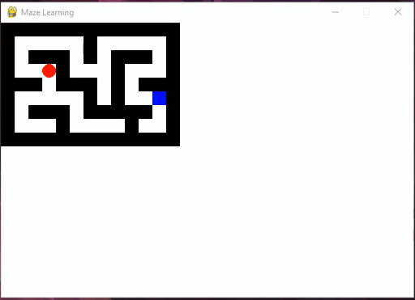

# Maze Reinforcement Learning Simulation

This project demonstrates a simple reinforcement learning (RL) agent learning to navigate through a maze to reach its redemption point. The simulation is built using Python and Pygame, providing a visual representation of the agent's learning process in real-time.

## Features
- **Maze Environment**: A customizable maze with walls and a redemption point.
- **Q-Learning Agent**: A red dot agent that learns to navigate the maze using the Q-learning algorithm.
- **Real-Time Visualization**: Watch the agent explore and learn in real-time using Pygame.
- **Terminal Output**: See the agent's decision-making process, including state, actions, and rewards.

## How It Works
The agent uses Q-learning, a model-free reinforcement learning algorithm, to learn the optimal path to the redemption point. Key components include:
- **Q-Table**: Stores the learned values for state-action pairs.
- **Epsilon-Greedy Strategy**: Balances exploration and exploitation.
- **Reward System**: Encourages the agent to reach the redemption point efficiently.

## Requirements
- Python 3.x
- Pygame (`pip install pygame`)

## How to Run
1. Clone the repository:
   ```bash
   git clone https://github.com/your-username/maze-rl-simulation.git
   cd simple-reinforcement-learning-simulation
   ```
2. Run the simulation:
   ```bash
   python script.py
   ```

## Customization
- **Maze Layout**: Modify the `maze_layout` variable in the code to create your own maze.
- **Learning Parameters**: Adjust `alpha`, `gamma`, and `epsilon` to fine-tune the agent's learning behavior.

## Screenshots
 *(Add a screenshot of the simulation here)*

## Code Overview
```python
# Key components
- Maze layout and walls
- Q-learning agent with state-action values
- Real-time visualization using Pygame
- Terminal output for debugging and insights
```

## Contributing
Contributions are welcome! Feel free to open issues or submit pull requests to improve the project.

## License
This project is licensed under the MIT License. See the [LICENSE](LICENSE) file for details.

---

Let me know if you'd like to add anything else! 🚀
